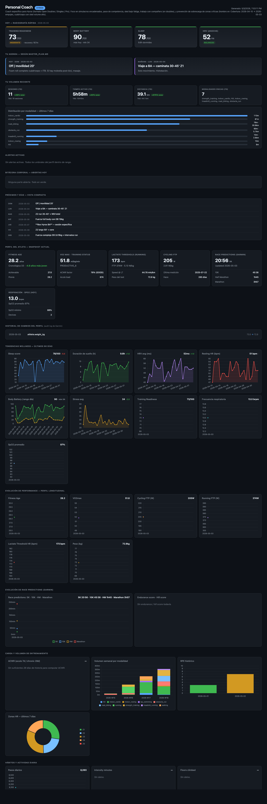

# Personal Coach

Coach personal **multi-objetivo** alimentado por tus datos de
[Garmin Connect](https://connect.garmin.com). Conversás con un coach
(Claude Code) que lee tu wellness y entrenamientos del día, te da
feedback cuantitativo, programa la próxima sesión y mantiene un ledger
append-only de todo lo que hiciste — sin que toques scripts ni planillas.

**El coach se tunea para tu objetivo concreto.** Elegís uno de los
perfiles incluidos o creás el tuyo. La persona del coach, las métricas
que vigila y los umbrales de alerta cambian — pero el resto del
proyecto (sync de Garmin, helpers, dashboard) es agnóstico al perfil.
**Si cambiás de objetivo, tu historia entera de entrenamientos se
preserva.**

| Perfil | Foco | Estado |
|---|---|---|
| `wellness` | Sueño, recovery, stress, hábitos, movimiento de base. **Default.** | Completo |
| `hyrox` | Específico Hyrox (Open Doubles / Singles / Pro). Simulacros encadenados, sled bajo fatiga, pace de competencia. | Completo |
| `half_marathon` | Media maratón. Estructura E/M/T/I/R, ACWR conservador. | Stub extensible |
| `triathlon` | Sprint / olímpico / 70.3 / Ironman. Tres disciplinas + bricks. | Stub extensible |
| `hypertrophy` | Hipertrofia general. Volumen progresivo por grupo, RIR controlado, deload. | Stub extensible |

Sumás más perfiles propios con un comando — ver
[Cómo agregar un perfil nuevo](#cómo-agregar-un-perfil-nuevo).

> Inspirado por
> [arpanghosh8453/garmin-grafana](https://github.com/arpanghosh8453/garmin-grafana).
> A diferencia de ese proyecto, acá no hay servidor, ni Docker, ni base
> de datos: todo son archivos planos en tu disco + un dashboard HTML
> autocontenido + un coach conversacional via Claude Code.

---

## Qué hace

1. **Sincroniza** tu wellness (sleep, HRV, RHR, body battery, stress) y
   actividades (con `.fit` raw incluido) desde Garmin Connect a `data/`.
2. **Entiende** tu objetivo según el perfil que elijas y carga el coach
   correspondiente.
3. **Conversa** con vos: sin que corras scripts, el coach detecta data
   faltante, te pregunta lo que necesite, persiste lo que le contás.
4. **Programa** sesiones según tu plan + tu wellness real + tu bitácora
   corporal.
5. **Trackea** RPE, desviaciones plan vs ejecutado, y molestias /
   lesiones (append-only).
6. **Genera un dashboard HTML** local con tu radiografía actual,
   alertas, tendencias, ACWR, volumen semanal y zonas HR.

---

## Demo del dashboard



Hero con las 4 métricas críticas del día (Training Readiness · Body
Battery · Sleep · HRV), agenda según `master_plan.md`, volumen reciente
con WoW deltas, snapshot del perfil del atleta (Fitness Age, VO2max,
LTHR, FTP cycling/running, Race Predictions, Body Composition),
tendencias wellness 90d, evolución longitudinal de performance, ACWR,
volumen semanal por modalidad, RPE, zonas HR y bitácora corporal.

Generalo con `python scripts/build_dashboard.py` y abrilo con doble
click — es un único HTML autocontenido (Chart.js inline), sin servidor
ni internet.

---

## Quickstart

### Requisitos

- **Python 3.11+** (testeado con 3.13).
- **Cuenta de Garmin Connect** activa con datos sincronizados (de un
  reloj o app).
- **[Claude Code](https://docs.claude.com/en/docs/claude-code)
  instalado** para usar el coach conversacional. **Esto requiere una
  cuenta Anthropic con plan activo (Pro / Max / Team) o créditos de
  API.** Sin Claude Code podés igual usar los scripts CLI fallback
  (`plan_session.py`, `feedback_session.py`) y el dashboard, pero
  perdés la experiencia conversacional principal.
- **Conocimiento básico de terminal** (clonar repo, instalar deps,
  editar archivos de texto). El coach asistido te guía después, pero
  los primeros 4 comandos los corrés vos en la terminal.
- **macOS / Linux** (Windows debería funcionar con WSL pero no está
  testeado).

### Modo asistido (recomendado, 2 comandos)

El coach detecta el primer uso y te guía por todo el setup en
conversación: elegís perfil, te pide datos, configura credenciales,
hace el bootstrap de Garmin y baja la primera tanda de history. Solo
necesitás **clonar e instalar deps**:

```bash
git clone <repo-url>
cd personal-coach
python3.13 -m venv .venv
.venv/bin/pip install -e .
```

Después abrí Claude Code en el directorio del proyecto y decí
**"hola"**. El coach se encarga del resto:

1. Te pregunta qué perfil querés (wellness / hyrox / half_marathon /
   triathlon / hypertrophy).
2. Te pregunta tu nombre y datos físicos básicos (LTHR si lo
   conocés, molestias activas).
3. Te crea el `.env` y te pide editar las credenciales de Garmin
   en VS Code.
4. Te pide correr `python scripts/garmin_auth_bootstrap.py` una
   sola vez (puede pedir MFA — por eso lo corrés vos).
5. Inicializa tus living docs, baja 30 días de history y genera el
   dashboard.
6. Te ofrece **personalizar el perfil con preguntas específicas**
   según tu objetivo (recomendado para perfiles stub).

Total: ~5-10 minutos en conversación. La regla está en
[`CLAUDE.md §0.0`](CLAUDE.md).

### Modo manual (si preferís control total)

```bash
# Después de clonar + venv + pip install -e .
cp .env.example .env
# editá .env y completá GARMIN_EMAIL / GARMIN_PASSWORD

cp profile.example.yml profile.yml
# editá profile.yml: elegí coach_profile, completá tu LTHR y datos

# Bootstrap de Garmin (una sola vez)
.venv/bin/python scripts/garmin_auth_bootstrap.py

# Inicializá tus living docs y bajá data
cp templates/master_plan.md master_plan.md
cp templates/executed_volume.md executed_volume.md
cp templates/plan_adjustments.md plan_adjustments.md
.venv/bin/python scripts/garmin_sync.py --backfill 30
.venv/bin/python scripts/build_dashboard.py
```

Después abrí Claude Code y decile "hola" para empezar a coachearte.

---

## Cómo elegir / cambiar perfil

El perfil activo está en `profile.yml`:

```yaml
coach_profile: wellness   # uno de: wellness, hyrox, half_marathon, triathlon, hypertrophy
```

Cambiarlo:

```yaml
coach_profile: hyrox      # ahora el coach pasa a modo hyrox
```

Cuando lo cambiás:

- El coach lee otro `profiles/<nuevo>/system_prompt.md` y otros
  umbrales de alerta.
- Tu `data/`, `executed_volume.md` y `plan_adjustments.md` **se
  preservan intactos** — son agnósticos al perfil. La historia
  longitudinal sigue creciendo append-only, atravesando todos tus
  cambios de objetivo.
- Probablemente quieras armar un `master_plan.md` nuevo para el
  nuevo objetivo (el coach te puede ayudar). El template del root
  (`templates/master_plan.md`) y la semana tipo del nuevo perfil
  (`profiles/<nuevo>/weekly_template.md`) te dan la estructura.

Más detalle en [`docs/profiles.md`](docs/profiles.md).

---

## Cómo agregar un perfil nuevo

```bash
mkdir profiles/mi_objetivo/
```

Creá tres archivos adentro:

- `profile.yml` — metadatos (`name`, `description`, `metrics_to_watch`,
  `alert_thresholds`, `feedback_cadence`).
- `system_prompt.md` — persona del coach, métricas que vigila, formato
  de salida obligatorio cuando propone una sesión.
- `weekly_template.md` — distribución semanal tipo (referencia para
  armar tu master plan).

El loader (`profiles/registry.py`) detecta automáticamente cualquier
perfil con un `profile.yml` válido. Para activarlo, poné
`coach_profile: mi_objetivo` en `profile.yml` del root.

Más detalle en [`docs/profiles.md`](docs/profiles.md).

---

## Arquitectura

Cuatro capas independientes:

1. **Sync de datos** — `scripts/garmin_sync.py` baja wellness +
   actividades + `.fit` raw a `data/YYYY-MM-DD/`.
2. **Helpers** — `scripts/_session_lib.py` parsea `.fit`, computa
   zonas HR, lee/escribe los living docs.
3. **Coach** — Claude Code corriendo en este directorio, leyendo
   `CLAUDE.md` (universal) + `profiles/<active>/system_prompt.md`
   (específico).
4. **Dashboard** — `dashboard/build.py` lee todo lo anterior y
   genera un `dashboard.html` autocontenido.

Diagrama Mermaid completo + sequence diagram del flujo diario en
[`docs/architecture.md`](docs/architecture.md).

---

## Flujo diario

Lo más simple: abrís Claude Code en el directorio del proyecto,
decís "hola". El coach hace **todo el resto**:

1. Carga tu perfil activo y los datos del atleta.
2. Si falta data del día, corre `garmin_sync.py`.
3. Si tenés < 28 días de history, hace backfill automático para que
   el dashboard tenga ACWR.
4. Si el dashboard está vencido, lo regenera.
5. Lee tus living docs + 7 días de data.
6. Te resume el estado en un párrafo.
7. Te hace una pregunta concreta según el perfil activo.

Vos solo conversás. La regla "el atleta no corre scripts" está
hardcodeada en [`CLAUDE.md`](CLAUDE.md) §1.

### Triggers proactivos del coach

Sin que se lo pidas, el coach detecta y pregunta:

- Hay actividades sincronizadas y no le contaste cómo fueron → te
  pregunta.
- HRV / sueño / RHR cayeron vs baseline (umbrales del perfil) → te
  pregunta cómo te sentís.
- Una parte del cuerpo lleva días `open` en la bitácora → te
  pregunta si sigue, mejoró o se resolvió.
- Pasaron días sin RPE cargado → te lo pide.

### Fallback CLI

Si preferís loggear sin chat, hay scripts interactivos por terminal
(`plan_session.py` pre-entreno, `feedback_session.py` post-entreno).
**No son necesarios** — el coach hace lo mismo en conversación.
Quedan como respaldo offline.

---

## Privacidad

Lo que **nunca** se commitea (gitignored por default):

- `.env` (credenciales Garmin)
- `profile.yml` (datos personales del atleta + perfil activo)
- `data/` (wellness, actividades, `.fit` raw)
- `reports/`, `docs/seed_history/`
- `master_plan.md`, `executed_volume.md`, `plan_adjustments.md`
  (tus living docs personales — los templates públicos viven en
  `templates/`)
- `dashboard.html` (tiene tus datos embebidos)
- Tokens de Garmin (`~/.garminconnect/`, fuera del repo)

Si vas a contribuir un PR con datos de ejemplo, anonimizalos antes.

---

## Troubleshooting

### Garmin: HTTP 429 (rate limit)

Pasa cuando hacés muchos logins SSO seguidos. La librería usa
tokens DI OAuth persistentes que se refrescan sin tocar SSO, así
que `garmin_sync.py` no debería gatillarlo. Si igual te cae:

- **No retries en loop** — la cuenta se bloquea más rápido si
  insistís.
- **No borres `~/.garminconnect/`** salvo certeza de que los tokens
  están corruptos. Borrarlos te fuerza un nuevo SSO que va a estar
  bloqueado igual.
- **Esperá 1 a 24 horas** — el bloqueo se libera solo.
- Cuando se libere, retomá con `garmin_sync.py` (NO con el
  bootstrap).

### El coach defaultea a `wellness` cuando yo quería otro perfil

Significa que `profile.yml` no existe en el root. Copialo del
template:

```bash
cp profile.example.yml profile.yml
# editá coach_profile y demás
```

### `dashboard.html` da error / está roto

Regeneralo:

```bash
python scripts/build_dashboard.py
```

Es idempotente y dura ~5 segundos. Si seguís con problema, chequeá
que `dashboard/vendor/chart.umd.min.js` exista (es el Chart.js
vendoreado).

### MFA habilitado en Garmin

El bootstrap (`scripts/garmin_auth_bootstrap.py`) te pide el código
de 6 dígitos por consola al primer login. Después de eso, los
tokens se refrescan solos por ~1 año.

### No tengo Claude Code instalado

El coach conversacional necesita
[Claude Code](https://docs.claude.com/en/docs/claude-code). Sin él,
podés:

- Usar los scripts CLI fallback (`plan_session.py`,
  `feedback_session.py`) — funcionan sin LLM.
- Usar el dashboard solo como visualización (lo regenerás a mano
  con `python scripts/build_dashboard.py`).

Soporte para otros LLMs (Anthropic SDK directo, OpenAI, etc.) está
postergado — ver `docs/architecture.md → Cómo extender`.

---

## Stack

- **Python 3.11+** con
  [`garminconnect`](https://pypi.org/project/garminconnect/) (sucesora
  moderna de [`garth`](https://github.com/matin/garth)),
  [`fitparse`](https://pypi.org/project/fitparse/),
  [`pyyaml`](https://pypi.org/project/PyYAML/), `python-dotenv`.
- **Coach:** [Claude Code](https://docs.claude.com/en/docs/claude-code)
  leyendo `CLAUDE.md` + el system prompt del perfil activo.
- **Dashboard:** HTML + CSS + JS vanilla +
  [Chart.js 4.4](https://www.chartjs.org/) (vendoreado en
  `dashboard/vendor/`).
- Sin servidor, sin Docker, sin DB. Todo plano en disco.

---

## Documentación

- [`CLAUDE.md`](CLAUDE.md) — operating instructions universales del
  coach (bootstrap, reglas, helpers).
- [`docs/profiles.md`](docs/profiles.md) — anatomía de un perfil,
  cómo extender, API Python.
- [`docs/architecture.md`](docs/architecture.md) — diagrama de
  componentes (Mermaid), sequence diagram, decisiones de diseño.
- [`docs/SCHEMA.md`](docs/SCHEMA.md) — formato exacto de cada `.md`
  editable (`session.md`, `executed_volume.md`,
  `plan_adjustments.md`, `master_plan.md`).
- [`dashboard/README.md`](dashboard/README.md) — qué muestra el
  dashboard, cómo extenderlo.
- [`CONTRIBUTING.md`](CONTRIBUTING.md) — setup local, organización,
  estilo, privacidad.

---

## Filosofía

- **Datos primero, opinión después.** Las decisiones del coach se
  basan en métricas medidas. Los umbrales del perfil hacen explícito
  qué métrica + qué valor disparan qué reacción.
- **Append-only en el log.** El historial es sagrado. Cuando cambiás
  de perfil (hyrox → hipertrofia → wellness), el `executed_volume.md`
  y la bitácora corporal siguen creciendo. El coach del nuevo perfil
  lee todo el pasado para entender de dónde venís.
- **Scripts no toman decisiones.** Solo descargan, parsean, resumen.
  Las decisiones de coaching viven en `CLAUDE.md`,
  `profiles/<active>/system_prompt.md` y `master_plan.md`.
- **Sin features de más.** Nada de servidor, mailers, push
  notifications. Markdown + JSON + un HTML local. Todo plano.

---

## Créditos e inspiración

- [`python-garminconnect`](https://github.com/cyberjunky/python-garminconnect)
  por la librería que hace todo el trabajo pesado del API de Garmin.
- [`garth`](https://github.com/matin/garth) por el patrón de tokens
  DI OAuth persistentes que evita los rate limits del SSO.
- [`arpanghosh8453/garmin-grafana`](https://github.com/arpanghosh8453/garmin-grafana)
  por la inspiración del dashboard de wellness con métricas de
  Garmin.
- [Claude Code](https://docs.claude.com/en/docs/claude-code) como
  harness conversacional del coach.

---

## Licencia

[MIT](LICENSE).
