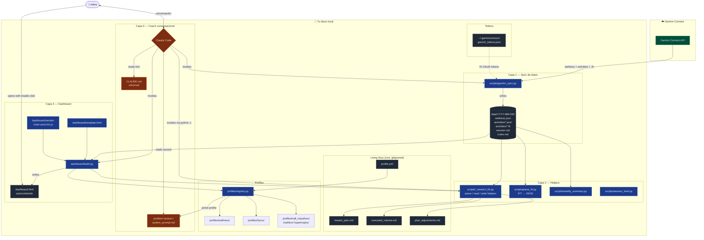
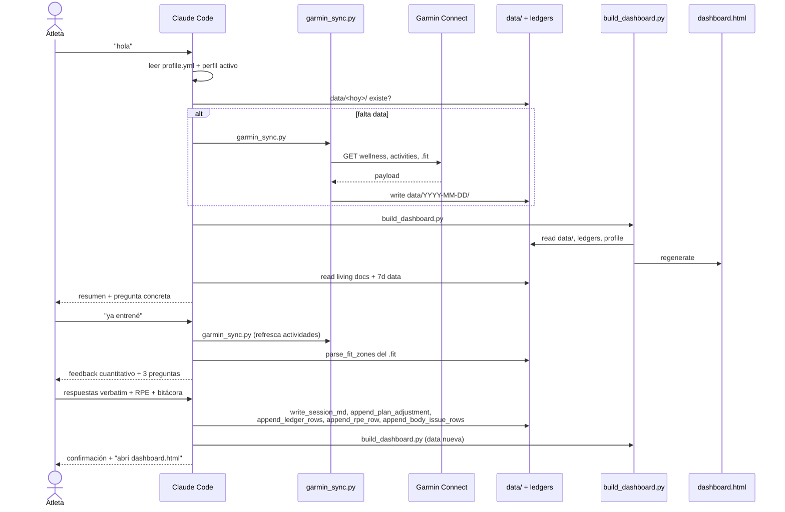

# Arquitectura

Personal Coach son **cuatro capas que viven en archivos planos en tu
disco**: sync de datos, helpers de parsing, coach conversacional,
dashboard. No hay servidor, ni base de datos, ni Docker. Cada capa es
reemplazable sin tocar las otras.

---

## Diagrama de componentes

---

## Las 4 capas

### Capa 1 — Sync de datos (`scripts/garmin_sync.py`)

Baja wellness + actividades + `.fit` raw desde Garmin Connect a
`data/YYYY-MM-DD/`. **Nunca toca SSO** después del bootstrap inicial —
usa tokens DI OAuth persistentes guardados en `~/.garminconnect/`,
que se refrescan vía `diauth.garmin.com`.

Idempotente: re-correrlo en una fecha sobreescribe los JSON sin
duplicar actividades. Modos: `--date`, `--from / --to`, `--backfill N`.

Fallback CLI manual: el atleta lo corre directamente. Pero el flujo
recomendado es que lo invoque Claude Code automáticamente cuando
detecte data faltante.

### Capa 2 — Helpers (`scripts/_session_lib.py`)

Single source of truth para:

- **Definición de zonas HR** (`ZONE_BOUNDS` con cortes absolutos en
  bpm, ancladas a la LTHR del proyecto).
- **Parsing de wellness** (`load_wellness`, `wellness_summary_fields`).
- **Parsing de `.fit`** para extraer zonas Z1-Z5
  (`parse_fit_zones`).
- **Lectura/escritura de los living docs** (`parse_session_md`,
  `write_session_md`, `append_plan_adjustment`, `append_ledger_rows`,
  `append_rpe_row`, `append_body_issue_rows`).
- **Computación del estado actual del cuerpo**
  (`current_open_body_issues`, `read_bitacora_rows`).

`scripts/parse_fit.py` es CLI thin wrapper de los helpers de zonas.
`scripts/weekly_summary.py` y `scripts/session_brief.py` son
read-only consolidators.

### Capa 3 — Coach conversacional

Es **Claude Code** corriendo en el directorio del proyecto. Lee dos
archivos como system prompt:

- [`CLAUDE.md`](../CLAUDE.md) — universal: bootstrap, reglas no
  negociables, formato del log, toolbox de scripts y helpers.
- `profiles/<active>/system_prompt.md` — específico del perfil:
  persona, métricas, formato de salida, triggers proactivos.

El perfil activo viene de `profile.yml → coach_profile` (default
`wellness`). El loader es `profiles/registry.load_active_profile()`.

El coach **ejecuta los scripts y helpers** (Bash + `python -c`) para
sincronizar data, persistir lo que el atleta cuenta, y regenerar el
dashboard. Nunca edita los `.md` editables a mano — usa los helpers
de escritura para mantener el roundtrip parse/render estable.

### Capa 4 — Dashboard (`dashboard/build.py`)

Lee todo lo anterior y genera un único `dashboard.html` autocontenido
(Chart.js + datos + CSS + JS, todo inline). Sin servidor, sin CDN, sin
internet. Lo abrís con doble click.

El dashboard es **perfil-aware**: las alertas usan los thresholds del
perfil activo. Cambiás de perfil → regenerás → ves otros umbrales
aplicados a los mismos datos subyacentes.

Comando: `python scripts/build_dashboard.py`. Idempotente.

---

## Flujo de datos típico

---

## Decisiones de diseño

### Por qué archivos planos en lugar de DB

- **Portabilidad.** El atleta clona, copia su `.env`, copia
  `profile.yml`, y todo está disponible.
- **Inspectable a mano.** Si el coach se rompe o el dashboard miente,
  abrís el `.md` o el `.json` y lo lees directo.
- **Append-only natural.** Los ledgers son tablas markdown — agregar
  filas es trivial y la historia es visible.
- **Sin lock-in.** No hay schema migrations, no hay versiones de DB,
  no hay backups raros.

Trade-off: queries complejas requieren scripts ad-hoc (no hay
SELECT). En la práctica, el dashboard cubre 95% de las queries que el
atleta hace; el coach genera el otro 5% sobre la marcha con `python -c`.

### Por qué Claude Code en lugar de un agente Python con SDK

- **Cero infra extra.** El coach es CLI gratuito, no requiere API key
  Anthropic ni servidor.
- **Tool-use natural.** Claude Code ya sabe usar Bash, Read, Write,
  Edit — no hay que diseñar un toolset.
- **Iteración rápida del system prompt.** Editás `CLAUDE.md` en VS
  Code y la próxima sesión lo carga automáticamente.

Trade-off: el coach solo funciona si tenés Claude Code instalado. En
el futuro podemos sumar un `agent/` directorio con providers
(`anthropic_sdk.py`, `openai_sdk.py`) y un entry point alternativo.

### Por qué dashboard HTML autocontenido en lugar de Grafana / web app

- **Cero infra.** Doble click y abre. Funciona sin internet.
- **Reproducible.** El HTML es determinístico — re-correr `build.py`
  con la misma data produce el mismo HTML.
- **Versionable.** Si querés trackear cómo evolucionó tu radiografía,
  podés commitear snapshots del HTML (no por default — está
  gitignored).

Trade-off: no es interactivo en tiempo real. Para ver data nueva,
regenerás. El coach lo hace automático cuando hay cambios.

---

## Cómo extender

### Agregar una nueva métrica al dashboard

1. Sumá un colector en `dashboard/build.py → collect_dashboard_data`.
2. Agregá un `<canvas>` y un bloque JS en
   `dashboard/template.html` que la grafique con Chart.js.
3. Si la métrica es perfil-específica, leela desde
   `profile.metrics_to_watch()` y skippeá si no aplica.

### Agregar un perfil nuevo

Ver [`docs/profiles.md → Cómo agregar un perfil nuevo`](profiles.md).

### Agregar un script ejecutable

1. Creá `scripts/<nombre>.py`.
2. Si reutilizás funcionalidad, importá de `_session_lib`.
3. Documentalo en `CLAUDE.md §6.2` para que el coach sepa cuándo
   invocarlo.

### Agregar un provider LLM (opcional, futuro)

Crear `agent/` con:

- `agent/base.py` — Protocol `AgentProvider`.
- `agent/anthropic_sdk.py` — provider via SDK Anthropic.
- `agent/openai_sdk.py` — etc.
- `scripts/coach.py` — entry point del modo SDK con loop conversacional
  + tool-use que llama a los helpers.

Postergado por YAGNI mientras Claude Code cumpla el rol del harness.
